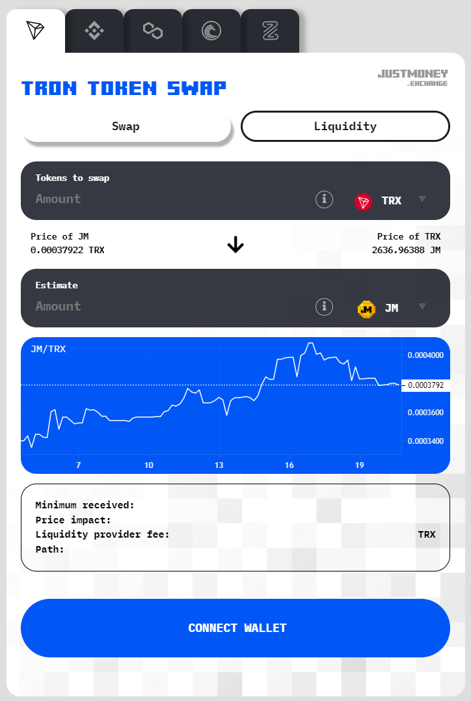
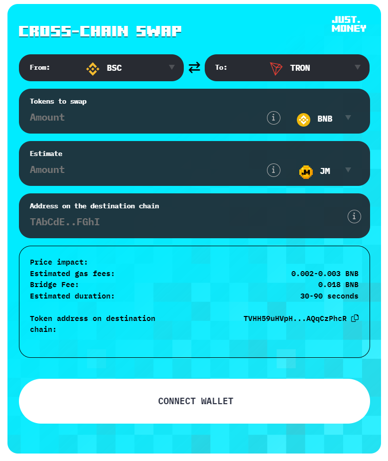
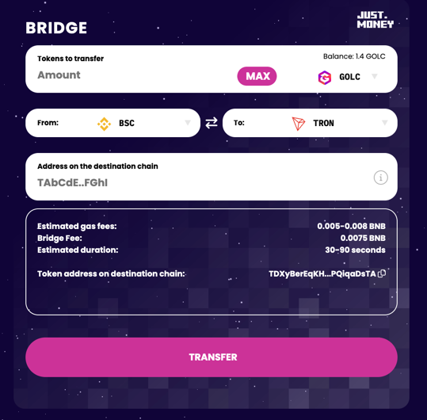

# Justmoney Swap widget 

A widget that can be placed on any website. It gives a functionality 
to swap tokens and add/remove liquidity to/from liquidity pairs that are in Justmoney.exchange.


## USAGE:


#### Format: JmApi.swapWidget(elementId, options);

In this case iframe element must be created in HTML. You need to pass elementId to the function and it will attach
to the correct element.


#### Format: JmApi.createSwapWidget(element, options);

This will create the iframe element. You need to pass "type" of the element in options object (see examples below).
Type can be "SINGLECHAIN", "MULTICHAIN" or "CROSSCHAIN". If type is not passed "SINGLECHAIN" will be used as default.

Element can be ID of already existing element or an instance of an HTMLElement. It will be appended inside that element.
If element does not exist it will be created with this given ID.
If element is null, the element will be created with random ID.

Returns: ID of the iframe element.

Parameters:
- type: type of the widget ("SINGLECHAIN", "MULTICHAIN" or "CROSSCHAIN")
- network: the network that this widget is for. String if type is 'SINGLECHAIN', array if type is 'MULTICHAIN'
- slippage: slippage setting for the swap
- liquidityTab: can add or remove liquidity if set to true
- shadow: draw shadow under the widget element
- tokens: array of tokens to be visible on the swap widget UI. Empty array shows all tokens.
- fromToken: default token selected for 'from' field
- toToken: default token selected for 'to' field
- backgroundColor: background color of the widget. Can also be set to 'transparent'
- backgroundImage: background image of the widget
- textColor: main text color
- buttonStyle: large button style
- maxButtonStyle: style of the "max" button which is shown after user has connected to the widget
- inputContainerStyle: style of the input containers and dropdown elements
- headingStyle: style of the main heading
- lightBranding: JustMoney logo white when set to true, dark if set to false


### Single chain EVM (POLY,BSC,BTTC,ZENITH)

```
<script src="https://just.money/assets/js/widgetLib-1.1.js"></script>
<script type="application/javascript">
    JmApi.swapWidget('jmSwapFrame', {
        network: 'BTTC',
        slippage: 0.05,
        liquidityTab: true,
        shadow: false,
        backgroundColor: '#F3F3F3',
        backgroundImage: 'url(/assets/img/swap-form-bg-lighter.svg);',
        textColor: '#000',
        buttonStyle: 'background:#000;color:#FFF;',
        maxButtonStyle: 'background:#FFF;color:#000;',
        headingStyle: 'color:#353840;text-shadow:none',
        lightBranding: false,
        tokens: ['TRX', 'BTT'],
        fromToken: "TRX",
        toToken: "BTT",
    });
</script>

<iframe id="jmSwapFrame" src="https://just.money/widget" style="width:500px;height:500px;margin:auto;display:block;" allowtransparency="true" frameborder="0" scrolling="no"></iframe>
```

Or create element automatically by

```
<script src="https://just.money/assets/js/widgetLib-1.1.js"></script>
<script type="application/javascript">
    JmApi.createSwapWidget('anyID', {
        type:'SINGLECHAIN'
        network: 'BTTC',
        slippage: 0.05,
        liquidityTab: true,
        shadow: false,
        backgroundColor: '#F3F3F3',
        backgroundImage: 'url(/assets/img/swap-form-bg-lighter.svg);',
        textColor: '#000',
        buttonStyle: 'background:#000;color:#FFF;',
        maxButtonStyle: 'background:#FFF;color:#000;',
        headingStyle: 'color:#353840;text-shadow:none',
        lightBranding: false,
        tokens: ['TRX', 'BTT'],
        fromToken: "TRX",
        toToken: "BTT",
    });
</script>
```


### Single chain (TRON)

```
<script src="https://just.money/assets/js/widgetLib-1.1.js"></script>
<script type="application/javascript">
    JmApi.swapWidget('jmSwapFrame', {
        network: 'TRON',
        slippage: 0.05,
        liquidityTab: true,
        shadow: false,
        backgroundColor: '#F3F3F3',
        backgroundImage: 'url(/assets/img/swap-form-bg-lighter.svg);',
        textColor: '#000',
        buttonStyle: 'background:#000;color:#FFF;',
        maxButtonStyle: 'background:#FFF;color:#000;',
        headingStyle: 'color:#353840;text-shadow:none',
        lightBranding: false,
        tokens: ['TRX', 'JM'],
        fromToken: "TRX",
        toToken: "JM",
    });
</script>

<iframe id="jmSwapFrame" src="https://just.money/widget" style="width:500px;height:500px;margin:auto;display:block;" allowtransparency="true" frameborder="0" scrolling="no"></iframe>
```
Or create element automatically by

```
<script src="https://just.money/assets/js/widgetLib-1.1.js"></script>
<script type="application/javascript">
    JmApi.createSwapWidget('anyID', {
        type:'SINGLECHAIN'
        network: 'TRON',
        slippage: 0.05,
        liquidityTab: true,
        shadow: false,
        backgroundColor: '#F3F3F3',
        backgroundImage: 'url(/assets/img/swap-form-bg-lighter.svg);',
        textColor: '#000',
        buttonStyle: 'background:#000;color:#FFF;',
        maxButtonStyle: 'background:#FFF;color:#000;',
        headingStyle: 'color:#353840;text-shadow:none',
        lightBranding: false,
        tokens: ['TRX', 'JM'],
        fromToken: "TRX",
        toToken: "JM",
    });
</script>
```


You can customize the options inside JMSwapOptions object e.g. change the background color, button colors or
tokens that will be visible.

If you want to show all the tokens and not limit the tokens, use empty array (tokens: [])

If you do not wish to show liquidity tab and allow liquidity operations for users set liquidityTab property to false.


### Multi-Chain



```
<script src="https://just.money/assets/js/widgetLib-1.1.js"></script>
<script type="application/javascript">
    JmApi.swapWidget('jmSwapFrame', {
        network: ['TRON','BSC','POLY','BTTC','ZENITH'],
        slippage: 0.05,
        liquidityTab: true,
        shadow: false,
        backgroundColor: '#7f8588',
        backgroundImage: 'url(/assets/img/swap-form-bg-lighter.svg);',
        textColor: '#000',
        buttonStyle: 'background:#0057f6;color:#FFF;',
        maxButtonStyle: 'background:#0057f6;color:#FFF;',
        chartBackgroundColor: '#0057f6',
        headingStyle: 'color:#0057f6;text-shadow:none',
        lightBranding: false,
        tokens: {
            TRON:[],
            BSC:[],
            POLY:[],
            BTTC:[],
            ZENITH:[],
        },
        fromToken: {
            TRON: "TRX",
            BSC:"USDT",
            POLY:"MATIC",
            BTTC:"TRX",
            ZENITH: "BUSD"
        },
        toToken: {
            TRON:"JM",
            BSC:"BNB",
            POLY:"USDT",
            BTTC:"BTT",
            ZENITH: "ZENITH"
        },
    });
</script>
<iframe id="jmSwapFrame" src="https://just.money/widget" style="width:500px;height:500px;margin:auto;display:block;" allowtransparency="true" frameborder="0" scrolling="no"></iframe>
```

Or create automatically by

```
<script src="https://just.money/assets/js/widgetLib-1.1.js"></script>
<script type="application/javascript">
    JmApi.createSwapWidget('anyID', {
        type:'MULTICHAIN'
        network: ['TRON','BSC','POLY','BTTC','ZENITH'],
        slippage: 0.05,
        liquidityTab: true,
        shadow: false,
        backgroundColor: '#7f8588',
        backgroundImage: 'url(/assets/img/swap-form-bg-lighter.svg);',
        textColor: '#000',
        buttonStyle: 'background:#0057f6;color:#FFF;',
        maxButtonStyle: 'background:#0057f6;color:#FFF;',
        chartBackgroundColor: '#0057f6',
        headingStyle: 'color:#0057f6;text-shadow:none',
        lightBranding: false,
        tokens: {
            TRON:[],
            BSC:[],
            POLY:[],
            BTTC:[],
            ZENITH:[],
        },
        fromToken: {
            TRON: "TRX",
            BSC:"USDT",
            POLY:"MATIC",
            BTTC:"TRX",
            ZENITH: "BUSD"
        },
        toToken: {
            TRON:"JM",
            BSC:"BNB",
            POLY:"USDT",
            BTTC:"BTT",
            ZENITH: "ZENITH"
        },
    });
</script>
```


Instead of having single network in "network" parameter you can use an array of networks. You need to also in this
case specify tokens, fromToken and toToken parameters for each network like shown in the example above.


### Cross-Chain




```
<script src="https://just.money/assets/js/widgetLib-1.1.js"></script>
<script type="application/javascript">
    JmApi.swapWidget('jmCCSwapFrame', {
        shadow: false,
        backgroundColor: '#00ebff',
        backgroundImage: 'url(/assets/img/swap-form-bg-lighter.svg);',
        textColor: '#000',
        buttonStyle: 'background:#FFF;color:#2E3344;',
        maxButtonStyle: 'background:#FFF;color:#2E3344;',
        headingStyle: 'color:#FFF;',
        lightBranding: true,
        tokens: {TRON:[], BSC:[], POLY:[], BTTC:[]},
        fromNetwork: "BSC",
        toNetwork: "TRON",
        fromToken: "BNB",
        toToken: "JM",
    });
</script>

<iframe id="jmCCSwapFrame" src="https://just.money/ccwidget" style="width:500px;height:500px;margin:auto;display:block;" allowtransparency="true" frameborder="0" scrolling="no"></iframe>
```

Or create automatically by

```
<script src="https://just.money/assets/js/widgetLib-1.1.js"></script>
<script type="application/javascript">
    JmApi.createSwapWidget('anyID', {
        type:'CROSSCHAIN'
        shadow: false,
        backgroundColor: '#00ebff',
        backgroundImage: 'url(/assets/img/swap-form-bg-lighter.svg);',
        textColor: '#000',
        buttonStyle: 'background:#FFF;color:#2E3344;',
        maxButtonStyle: 'background:#FFF;color:#2E3344;',
        headingStyle: 'color:#FFF;',
        lightBranding: true,
        tokens: {TRON:[], BSC:[], POLY:[], BTTC:[]},
        fromNetwork: "BSC",
        toNetwork: "TRON",
        fromToken: "BNB",
        toToken: "JM",
    });
</script>
```


# Justmoney Bridge widget 

The bridge widget works similar way as the swap widget but with small differences in the parameters and function to call.

A widget that can be placed on any website. It gives a functionality
to bridge tokens (listed in JustMoney Bridge) between the chain.




## USAGE:


#### Format: JmApi.bridgeWidget(elementId, options);

In this case iframe element must be created in HTML. You need to pass elementId to the function and it will attach
to the correct element.


#### Format: JmApi.createBridgeWidget(element, options);

This will create the iframe element with the bridge UI inside it.

Element can be ID of already existing element or an instance of an HTMLElement. It will be appended inside that element.
If element does not exist it will be created with this given ID.
If element is null, the element will be created with random ID.

Returns: ID of the iframe element.

Note that for the bridge widget you need to import https://just.money/assets/js/widgetLibBridge-1.0.js

**Parameters:**
- network: default network that will be chosen initially
- tokens: array of tokens to be visible on the bridge widget UI. Empty array shows all tokens.
- defaultToken: token that will be selected by default
- googleFontFamily: allows to set custom font from Google Fonts
- backgroundColor: background color of the widget. Can also be set to 'transparent'
- backgroundImage: background image of the widget
- textColor: main text color
- buttonStyle: large button style
- maxButtonStyle: style of the "max" button which is shown after user has connected to the widget
- inputContainerStyle: style of the input containers and dropdown elements
- headingStyle: style of the main heading
- lightBranding: JustMoney logo white when set to true, dark if set to false

Examples:

```
<script src="https://just.money/assets/js/widgetLibBridge-1.0.js"></script>
<script type="application/javascript">
    JmApi.createBridgeWidget('jmBridgeFrame1', {
        network: 'BSC',
        backgroundColor: '#00ebff',
        backgroundImage: 'url(/assets/img/swap-form-bg-lighter.svg);',
        textColor: '#000',
        buttonStyle: 'background:#FFF;color:#2E3344;',
        maxButtonStyle: 'background:#FFF;color:#2E3344;',
        headingStyle: 'color:#FFF;',
        lightBranding: true,
        tokens: [],
        defaultToken: "JM"
    });
</script>

```

```
<script src="https://just.money/assets/js/widgetLibBridge-1.0.js"></script>
<script type="application/javascript">
    JmApi.createBridgeWidget('jmBridgeFrame1', {
        network: 'BSC',
        backgroundColor: 'transparent',
        backgroundImage: 'url(/assets/img/swap-form-bg-lighter.svg);',
        textColor: '#FFF',
        buttonStyle: 'background:#cc3399;color:#FFF;',
        maxButtonStyle: 'background:#cc3399;color:#FFF;',
        inputContainerStyle: 'background: white;color: #000',
        googleFontFamily: 'Poppins',
        headingStyle: 'color:#FFF;',
        lightBranding: true,
        tokens: ['GOLC'],
        defaultToken: "GOLC"
    });
</script>

```

