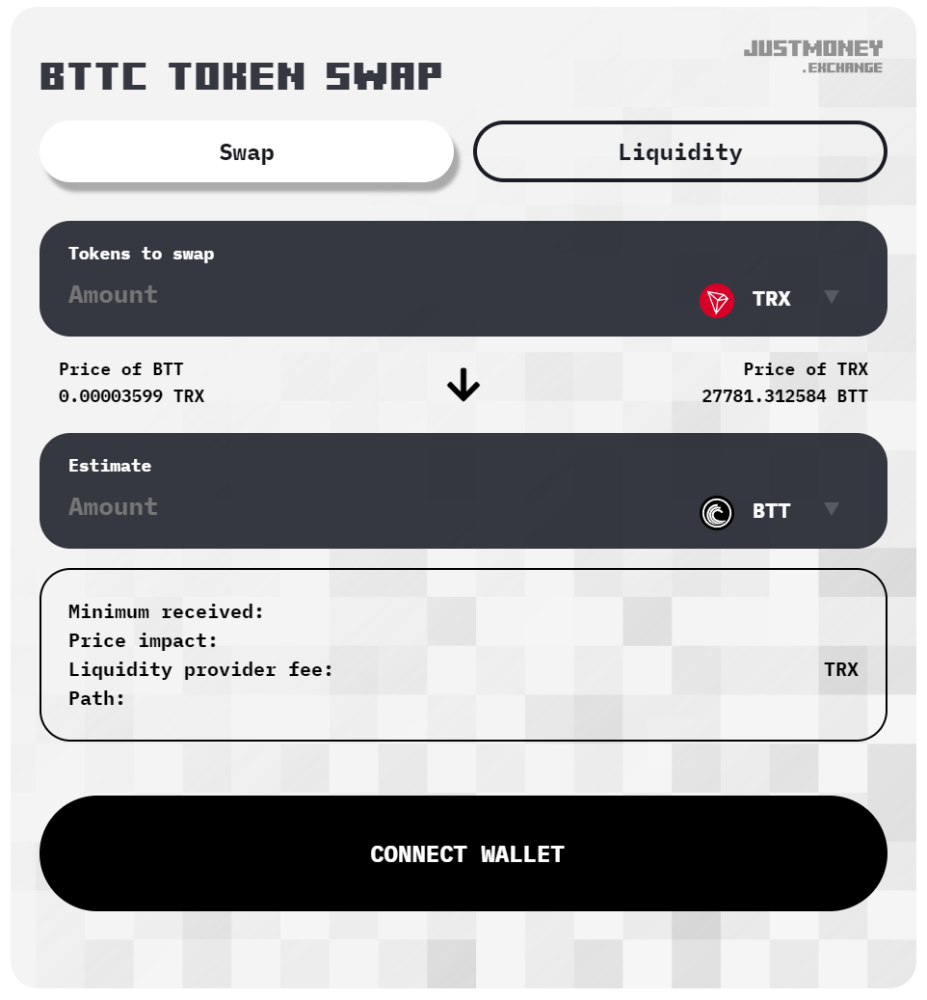

# Justmoney Swap widget 

A widget that can be placed on any website. It gives a functionality 
to swap tokens and add/remove liquidity to/from liquidity pairs that are in Justmoney.exchange.




## USAGE:

### Bittorrent Chain

```
<iframe id="jmSwapFrame" src="https://bttc.justmoney.exchange/widget" style="width:500px;height:500px;margin:auto;display:block;" allowtransparency="true" frameborder="0" scrolling="no"></iframe>
<script type="application/javascript">
    var JMSwapOptions = {
        network: 'BTTC',
        slippage: 0.05,
        liquidityTab: true,
        shadow: false,
        backgroundColor: '#F3F3F3',
        backgroundImage: 'url(/assets/img/swap-form-bg-lighter.svg);',
        textColor: '#000',
        buttonStyle: 'background:#000;color:#FFF;',
        maxButtonStyle: 'background:#FFF;color:#000;',
        headingStyle: 'color:#353840;text-shadow:none',
        lightBranding: false,
        tokens: ['TRX', 'BTT'],
        fromToken: "TRX",
        toToken: "BTT",
    }
</script>
<script src="https://bttc.justmoney.exchange/assets/js/widgetLib-bttc-1.0.js"></script>
```

You can customize the options inside JMSwapOptions object e.g. change the backgound color, button colors or
tokens that will be visible.

If you want to show all the tokens and not limit the tokens, use empty array (tokens: [])

If you do not wish to show liquidity tab and allow liquidity operations for users set liquidityTab property to false.
